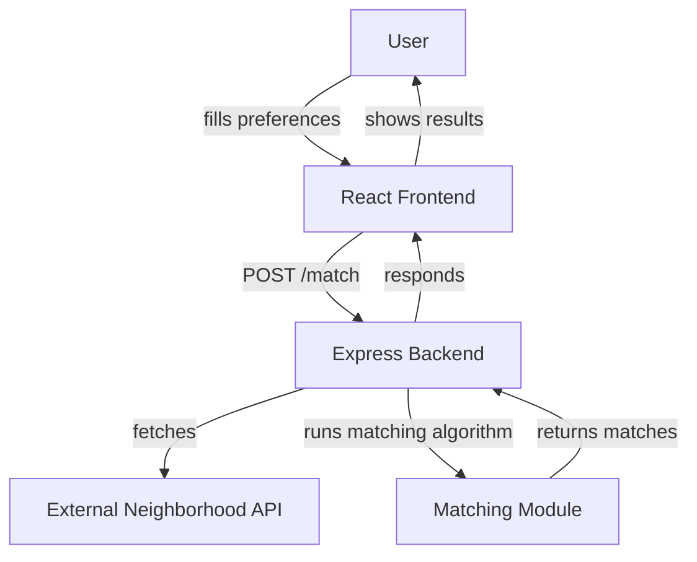

> ⚠️ **Warning**  
> Backend deployment may occasionally fail due to platform-related glitches or unexpected errors.

# NeighborFit-App

NeighborFit is a full-stack web application designed to help users find their ideal neighborhood based on personalized preferences. It features a modern React frontend and a robust Node.js/Express backend, implementing a sophisticated matching algorithm to provide tailored neighborhood recommendations.

## Deployed Application

Access the live application here: [https://neighbor-fit-app-phi.vercel.app/](https://neighbor-fit-app-phi.vercel.app/)

## 📸 Some Screenshots
.png>)
.png>)
.png>)
## Table of Contents

- [Features](#features)
- [Tech Stack](#tech-stack)
- [Architecture](#architecture)
- [API Endpoints](#api-endpoints)
- [Data Processing & Algorithms](#data-processing--algorithms)
- [Installation & Setup](#installation--setup)
- [Usage](#usage)
- [Contributing](#contributing)
- [License](#license)

## Features

- **Personalized Neighborhood Matching:** Users can input preferences (budget, safety, walkability, family-friendliness, quietness) to find the best-suited neighborhoods.
- **Explainable Matches:** Provides 


detailed "match reasons" for each recommendation.
- **Comprehensive Neighborhood Data:** Utilizes external API data for a wide range of neighborhood characteristics.
- **Responsive User Interface:** Built with React and Tailwind CSS for a seamless experience across devices.
- **Health Checks & Robust APIs:** Backend includes health check endpoints and well-defined RESTful APIs.
- **Modular and Extensible Architecture:** Designed for easy maintenance and future enhancements.

## Tech Stack

### Frontend
- **Framework:** React (with JSX, functional components, hooks)
- **Build Tool:** Vite
- **Styling:** Tailwind CSS, custom CSS, Google Fonts (Poppins)
- **Linting:** ESLint (with React)
- **Icons:** Lucide-react

### Backend
- **Framework:** Node.js with Express.js
- **Data Fetching:** Axios (for external API calls)
- **Environment Management:** `dotenv`
- **Development Tools:** Nodemon (for hot-reloading), ESLint


## Architecture

The application follows a client-server architecture, with the React frontend communicating with the Node.js/Express backend. The backend is responsible for fetching neighborhood data from an external API and running the matching algorithm.



## API Endpoints

The backend exposes the following RESTful API endpoints:

- **`GET /health`**
  - **Purpose:** Health check to confirm backend and data availability.
  - **Returns:** `{ status: 'healthy', neighborhoods_loaded: <count> }`

- **`GET /neighborhoods`**
  - **Purpose:** Fetches all available neighborhoods.
  - **Returns:** `{ neighborhoods: [...], count: <number> }`

- **`POST /match`**
  - **Purpose:** Returns the top 5 neighborhood matches for the user’s preferences.
  - **Body:** `{ budget, safetyImportance, walkabilityImportance, familyFriendly, quietEnvironment }`
  - **Returns:** `{ success: true, matches: [...], total_neighborhoods: <number> }`


## Data Processing & Algorithms

### Data Loading
Neighborhood data is fetched from an external API (URL configured via `NEIGHBORHOOD_API_URL` in `.env`). The data undergoes normalization, including conversion of numeric fields, filtering of null values, and splitting of highlight information.

### Matching Algorithm (Backend)

- **Inputs:** User preferences for budget, safety importance, walkability importance, family-friendliness, and quiet environment.
- **Scoring:** Each neighborhood is scored based on how well it aligns with user preferences:
  - **Budget:** Score derived from the average rent relative to the user's budget.
  - **Safety:** Normalized safety score, weighted by user's importance.
  - **Walkability:** Normalized walkability score, weighted by user's importance.
  - **Family-friendliness:** Weighted if the user prioritizes this criterion.
  - **Quietness:** Weighted if the user prioritizes a quiet environment.
- **Total Score:** A weighted sum of individual scores:
  - Budget (30%), Safety (25%), Walkability (20%), Family (15%), Quiet (10%)
- **Match Reasons:** Explanations are generated to clarify why a particular neighborhood is a strong match based on the criteria.
- **Output:** The top 5 neighborhoods are returned, sorted by their match score, along with their component scores and match reasons.


## Installation & Setup

To set up the NeighborFit application locally, follow these steps:

1.  **Clone the repository:**
    ```bash
    git clone https://github.com/priyanshuranjank/NeighborFit-App.git
    cd NeighborFit-App
    ```

2.  **Backend Setup:**
    ```bash
    cd backend
    npm install
    ```
    Create a `.env` file in the `backend` directory and add your `NEIGHBORHOOD_API_URL` & `PORT`
     (e.g., `NEIGHBORHOOD_API_URL=YOUR_EXTERNAL_API_URL` & `PORT=5000`).
    ```bash
    npm start
    # Or for development with hot-reloading:
    npm run dev
    ```

3.  **Frontend Setup:**
    ```bash
    cd ../frontend
    npm install
    npm run dev
    ```
    The frontend application will typically run on `http://localhost:5173` (or a similar port).

## Usage

1.  Navigate to the deployed application or run it locally.
2.  On the landing page, input your preferences for budget, safety, walkability, family-friendliness, and quietness.
3.  Click the "Find My Neighborhood" button to get personalized recommendations.
4.  Review the top 5 matched neighborhoods, along with their match reasons and scores.

## 👨‍💻 Author

Priyanshu Ranjan - [priyanshuranjan@gmail.com](mailto:priyanshuranjan@gmail.com)

Project Link: [https://github.com/priyanshuranjank/NeighborFit-App](https://github.com/priyanshuranjank/NeighborFit-App)

## 🙏 Acknowledgments

- [React](https://reactjs.org/) – Frontend library used for building the user interface  
- [Vite](https://vitejs.dev/) – Fast build tool and dev server for React  
- [Tailwind CSS](https://tailwindcss.com/) – Utility-first CSS framework for styling  
- [Lucide React](https://lucide.dev/) – Icon library used for consistent UI icons  
- [Vercel](https://vercel.com/) – Hosting platform for the frontend  
- [Node.js](https://nodejs.org/) – JavaScript runtime for backend logic  
- [Express.js](https://expressjs.com/) – Minimal and flexible Node.js web application framework  
- [Axios](https://axios-http.com/) – Promise-based HTTP client used for external API calls  
- [Dotenv](https://www.npmjs.com/package/dotenv) – For secure environment variable management  
- [Render](https://render.com/) – Cloud platform used for backend deployment  


## Contributing

Contributions are welcome! Please feel free to open issues or submit pull requests. For major changes, please open an issue first to discuss what you would like to change.

## License

This project is licensed under the MIT License - see the [LICENSE](LICENSE) file for details.

---

⭐ If you found this project helpful, feel free to give it a ⭐ on GitHub!

